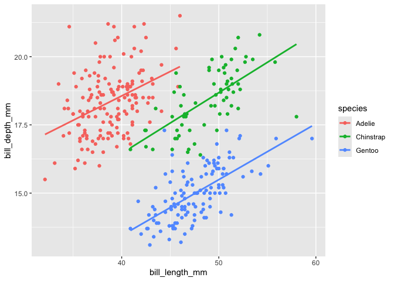
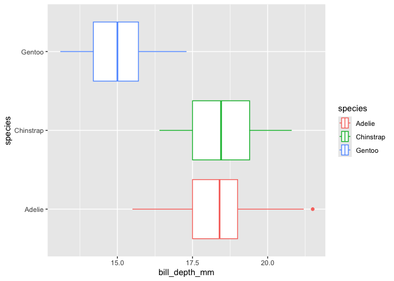
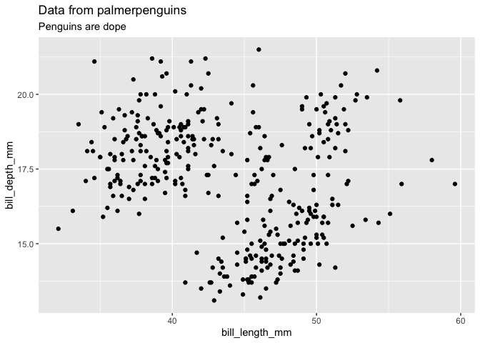
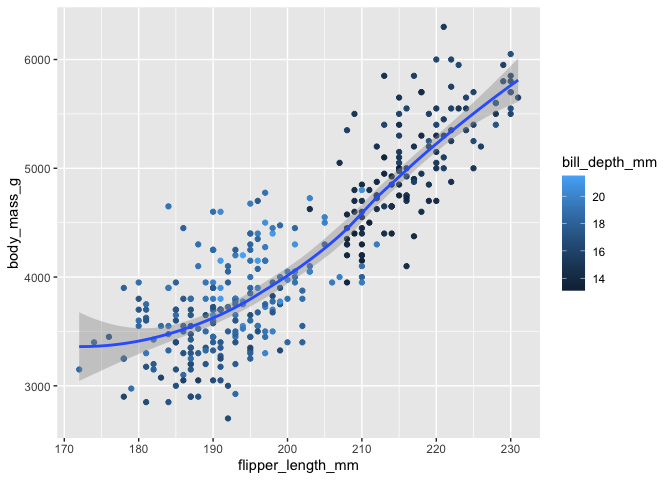
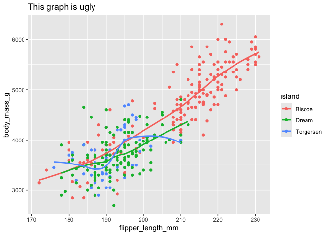

Data_Vis - 1/9/25
================
2025-01-09

``` r
library(palmerpenguins)
library(tidyverse)
```

    ## ── Attaching core tidyverse packages ──────────────────────── tidyverse 2.0.0 ──
    ## ✔ dplyr     1.1.4     ✔ readr     2.1.5
    ## ✔ forcats   1.0.0     ✔ stringr   1.5.1
    ## ✔ ggplot2   3.5.1     ✔ tibble    3.2.1
    ## ✔ lubridate 1.9.3     ✔ tidyr     1.3.1
    ## ✔ purrr     1.0.2     
    ## ── Conflicts ────────────────────────────────────────── tidyverse_conflicts() ──
    ## ✖ dplyr::filter() masks stats::filter()
    ## ✖ dplyr::lag()    masks stats::lag()
    ## ℹ Use the conflicted package (<http://conflicted.r-lib.org/>) to force all conflicts to become errors

# how many rows are in penguins?

``` r
nrow(penguins)
```

    ## [1] 344

``` r
ncol(penguins)
```

    ## [1] 8

\##What does bill_depth_mm mean?

``` r
?penguins
```

\#make a scatter plot of bill depth vs bill length and what is the
relationship between them?

``` r
ggplot(
   penguins,
   aes(x = bill_length_mm, y = bill_depth_mm, color = species)
   ) +
   geom_point() +
   geom_smooth(method = 'lm', se = F)
```

    ## `geom_smooth()` using formula = 'y ~ x'

    ## Warning: Removed 2 rows containing non-finite outside the scale range
    ## (`stat_smooth()`).

    ## Warning: Removed 2 rows containing missing values or values outside the scale range
    ## (`geom_point()`).

<!-- -->

\#scatter plot bill depth and species

``` r
ggplot(
   penguins,
   aes(x = bill_depth_mm, y = species, color = species)
   ) +
   geom_boxplot()
```

    ## Warning: Removed 2 rows containing non-finite outside the scale range
    ## (`stat_boxplot()`).

<!-- -->

\#troubleshooting problem

``` r
ggplot(data = penguins, aes(x=bill_length_mm, y=bill_depth_mm)) + 
  geom_point(outl.rm = T)
```

    ## Warning in geom_point(outl.rm = T): Ignoring unknown parameters: `outl.rm`

    ## Warning: Removed 2 rows containing missing values or values outside the scale range
    ## (`geom_point()`).

<!-- -->

\#what does na.rm do? It removes your na values; by default it normally
does not remove them

\#using labs() function – labels things

``` r
ggplot(data = penguins, aes(x=bill_length_mm, y=bill_depth_mm)) + 
  geom_point() + 
  labs(
    title = "Data from palmerpenguins",
    subtitle = "Penguins are dope"
  )
```

    ## Warning: Removed 2 rows containing missing values or values outside the scale range
    ## (`geom_point()`).

<!-- -->

\#Recreating a plot

``` r
ggplot(penguins, aes(x=flipper_length_mm, y=body_mass_g)) + 
  geom_point(aes(color = bill_depth_mm)) +
  geom_smooth() 
```

    ## `geom_smooth()` using method = 'loess' and formula = 'y ~ x'

    ## Warning: Removed 2 rows containing non-finite outside the scale range
    ## (`stat_smooth()`).

    ## Warning: Removed 2 rows containing missing values or values outside the scale range
    ## (`geom_point()`).

<!-- -->

\#recreting plot with different color scheme

``` r
ggplot(penguins, aes(x=flipper_length_mm, y=body_mass_g, colour = bill_depth_mm)) + 
  geom_point() +
  geom_smooth() 
```

    ## `geom_smooth()` using method = 'loess' and formula = 'y ~ x'

    ## Warning: Removed 2 rows containing non-finite outside the scale range
    ## (`stat_smooth()`).

    ## Warning: The following aesthetics were dropped during statistical transformation:
    ## colour.
    ## ℹ This can happen when ggplot fails to infer the correct grouping structure in
    ##   the data.
    ## ℹ Did you forget to specify a `group` aesthetic or to convert a numerical
    ##   variable into a factor?

    ## Warning: Removed 2 rows containing missing values or values outside the scale range
    ## (`geom_point()`).

<!-- -->

\#run this block of code and predict what it does

``` r
ggplot(
      data = penguins,
      mapping = aes(x = flipper_length_mm, y = body_mass_g, color = island)
    ) +
      geom_point() +
      geom_smooth(se = FALSE) +
      labs(
        title = "This graph is ugly")
```

    ## `geom_smooth()` using method = 'loess' and formula = 'y ~ x'

    ## Warning: Removed 2 rows containing non-finite outside the scale range
    ## (`stat_smooth()`).

    ## Warning: Removed 2 rows containing missing values or values outside the scale range
    ## (`geom_point()`).

<!-- -->
